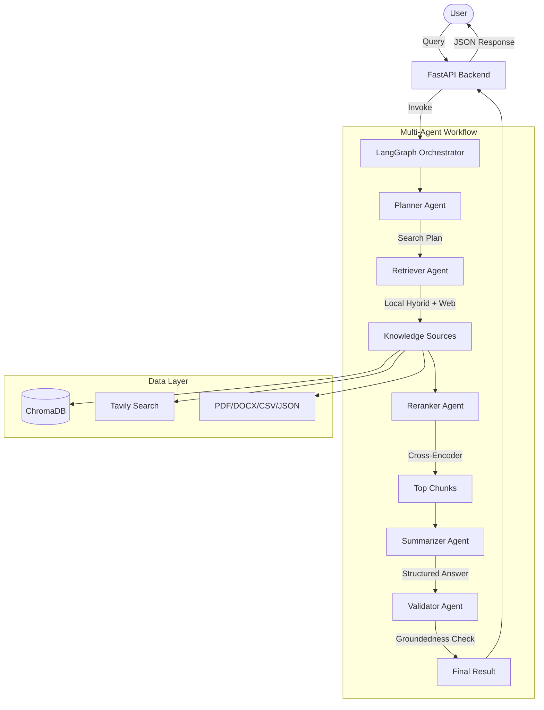

# MEKA: Multi-Agent Expert Knowledge Assistant

MEKA is an industry-grade Multi-Agent RAG (Retrieval-Augmented Generation) system designed to extract insights from heterogeneous knowledge bases (PDF, DOCX, CSV, JSON, TXT) and supplemental web sources.

## System Architecture

## Key Components

1.  **Heterogeneous Ingestion**: Supports `.txt`, `.pdf`, `.docx`, `.csv`, and `.json`.
2.  **Hybrid Retrieval**: Combines semantic vector search (ChromaDB + HuggingFace) with keyword-based search (BM25).
3.  **Tavily Web Integration**: Supplemental real-time information via web search.
4.  **Cross-Encoder Reranking**: MS Marco MiniLM for high-precision context filtering.
5.  **Multi-Agent Workflow**: Stateful coordination via **LangGraph** with a full reasoning trace.

## AI Tools Used & Rationale

-   **Groq (Llama-3.1-8B-Instant)**: Chosen for its sub-second latency, which is critical for multi-agent loops where multiple LLM calls are sequential.
-   **HuggingFace (`all-MiniLM-L6-v2`)**: A lightweight yet effective embedding model for local semantic search.
-   **ChromaDB**: Chosen for its simplicity and persistence for local vector storage.
-   **Tavily**: Dedicated search engine optimized for LLMs/Rag, providing clean content for agents.
-   **Sentence Transformers**: Used for the Cross-Encoder reranking stage to ensure only the most relevant snippets reach the final prompt.

## Agent Workflow Logic

1.  **Planner**: Analyzes the query and current settings (like web search) to create a decomposition plan.
2.  **Retriever**: Executes parallel retrieval from local vector stores, keyword indexes, and optionally the web.
3.  **Reranker**: Recalculates relevance scores for all retrieved segments using a deep cross-encoder model.
4.  **Summarizer**: Synthesizes the final answer, ensuring all claims are backed by the reranked context.
5.  **Validator**: Performs a final groundedness check to detect and flag potential hallucinations.

## API Documentation

| Endpoint | Method | Description |
| :--- | :--- | :--- |
| `/ask` | `POST` | Synchronous query execution. Returns answer + reasoning. |
| `/query` | `POST` | Asynchronous query execution. Returns `query_id`. |
| `/status/{id}` | `GET` | Get the status and result of an async query. |
| `/history` | `GET` | Get the history of all processed queries. |

### Example Queries & Sample Output

### Query: "Summarize our current security policies."
**Web Search:** Disabled
**Sample Output:**
> "Our current security policies include a strict password requirement where all passwords must be at least 12 characters long. Additionally, the company supports a hybrid remote work model allowing employees to work from home 3 days per week."
**Reasoning Trace:**
1. Planner: Created extraction plan - Search for security and password policies in local docs.
2. Retriever: Fetched 2 segments from Local Hybrid.
3. Reranker: Re-scored 2 segments, optimized to top 2.
4. Summarizer: Synthesized final answer from reranked context.
5. Validator: Answer is GROUNDED - Answer is directly supported by policies.csv.

## Architectural Decisions & Rationale

-   **Vector Database (ChromaDB)**: Selected for its local persistence and zero-config setup, making it ideal for standard organizational knowledge bases that require privacy and high performance.
-   **Hybrid Retrieval (BM25 + Vector)**: We combine semantic search (vector) for concept matching with keyword search (BM25) to ensure that specific technical terms or IDs (like "GDPR Article 32") are never missed.
-   **Cross-Encoder Reranking**: Standard vector search can be "noisy." By using a Cross-Encoder as a second stage, we perform a much deeper semantic check on the top candidates, significantly increasing the precision of the final answer.
-   **Asynchronous Processing**: RAG pipelines with multiple agents can take several seconds. We provide an async `/query` endpoint to support professional integrations where the UI shouldn't block during long-running reasoning chains.

## Development Environment
- **IDE**: VS Code / Windsurf
- **Language**: Python 3.11
- **Frameworks**: FastAPI (Backend), React (Frontend), LangGraph (Orchestration)

## Getting Started

1.  **Prerequisites**: Python 3.9+, Node.js 18+.
2.  **Environment**: Create `.env` with `GROQ_API_KEY` and `TAVILY_API_KEY`.
3.  **Install & Run**:
    -   Backend: `pip install -r requirements.txt` then `uvicorn app.main:app --reload`
    -   Frontend: `cd frontend && npm install && npm run dev`

## Trade-offs & Limitations

-   **Model Size**: Uses Llama-3.1-8B for speed; for extremely complex legal analysis, a larger model might be required.
-   **Local Processing**: Reranking is done locally; large document sets may require GPU acceleration for faster inference.
-   **Memory**: Currently uses stateful session memory but not long-term per-user persistence (beyond query history).

---
*Developed as a high-performance Multi-Agent RAG Assistant.*
