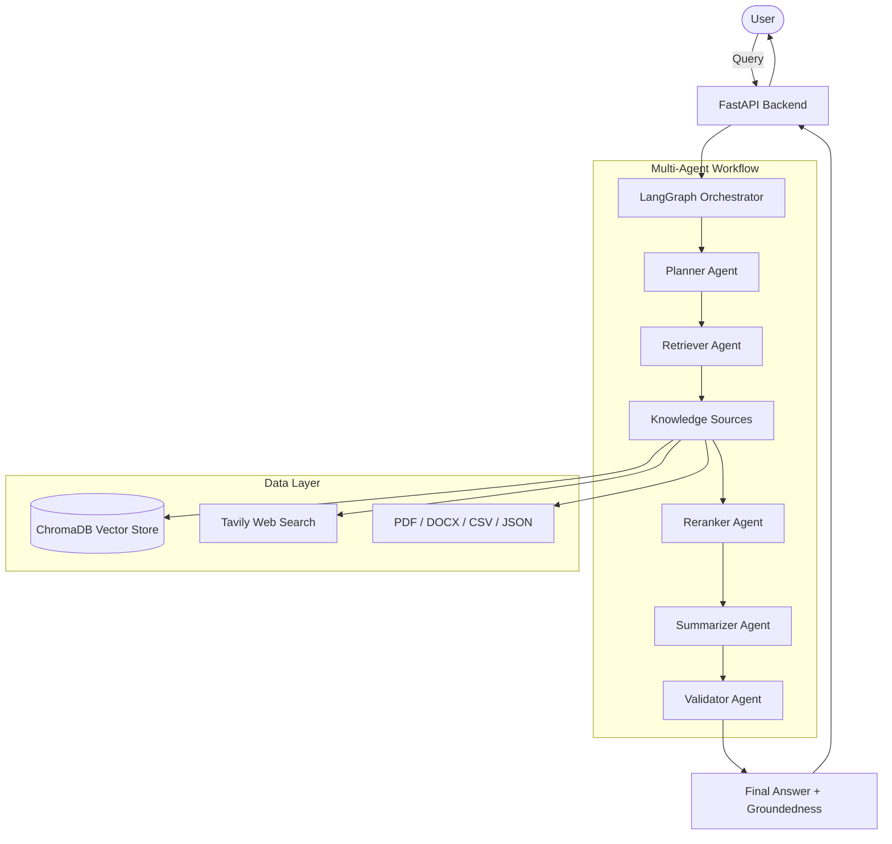

# MEKA: Multi-Agent Expert Knowledge Assistant

MEKA is an industry-grade Multi-Agent Retrieval-Augmented Generation (RAG) system designed to extract, reason over, and validate information from heterogeneous knowledge sources such as PDFs, DOCX, CSV, JSON, and real-time web data.

---

## 1. System Architecture Diagram

---

## 2. Agent Workflow Logic (Sequence & Delegation)

1.  **Planner Agent**: Decomposes the user query into sub-tasks and determines whether supplemental web search is required based on internal knowledge coverage.
2.  **Retriever Agent**: Executes **Hybrid Retrieval** combining Semantic search (ChromaDB + embeddings), Keyword search (BM25), and optional Web retrieval (Tavily).
3.  **Reranker Agent**: Applies cross-encoder reranking to deeply evaluate relevance and remove "noisy" chunks, ensuring only high-signal context passes forward.
4.  **Summarizer Agent**: Synthesizes the final structured answer strictly from the reranked evidence chains.
5.  **Validator Agent**: Performs a final groundedness verification to detect and flag potential hallucinations before delivery.

---

## 3. Tool Choices and Rationale

*   **Hybrid Search (BM25 + Vector)**: I used ChromaDB for semantic search to capture conceptual meaning, paired with BM25 (rank_bm25) because keyword search is essential for capturing exact technical terms, IDs, or SKUs that embeddings might overlook.
*   **Cross-Encoder Reranking**: I integrated `SentenceTransformers` for reranking because standard vector similarity can be "noisy." A cross-encoder performs a much deeper semantic evaluation, significantly increasing the precision of the context provided to the LLM.
*   **LangGraph Orchestration**: I chose LangGraph because it allows for stateful, cyclical multi-agent workflows with explicit control over delegation and memory, which is critical for complex reasoning tasks.

---

## 4. AI Tools Used

| Tool | Purpose | Reasoning |
| :--- | :--- | :--- |
| **Groq (Llama-3.1-8B)** | LLM Reasoning | Extremely low latency (sub-second); vital for sequential agent loops. |
| **HuggingFace (all-MiniLM)**| Embeddings | Lightweight yet effective for local semantic search persistence. |
| **Tavily API** | Web Search | Optimized specifically for LLM/RAG pipelines with clean content. |
| **ChromaDB** | Vector Store | Selected for its simplicity, persistence, and local-first performance. |

---

## 5. Development Environment / IDE Used

*   **IDE**: VS Code + Antigravity (Agentic AI Assistant)
*   **Justification**: VS Code was used as the primary editor, while Antigravity (Agentic AI Assistant) was leveraged for rapid prototyping, architectural reasoning, and iterative refinement of multi-agent orchestration logic. This combination improved development velocity while maintaining control over design decisions and implementation quality.

---

## 6. Trade-offs and Limitations

*   **Latency vs. Depth**: I used Llama-3.1-8B on Groq to prioritize speed. For extremely nuanced legal or medical analysis, a larger model (e.g., Llama-70B) might be required, though at higher latency.
*   **Hardware Dependencies**: The Reranker inference is currently CPU-bound. In a high-traffic production environment, GPU acceleration would be necessary to maintain throughput.
*   **Storage Scale**: I am using file-based persistence for query history. For massive multi-user scaling, this would be migrated to a production SQL database like PostgreSQL.

---

## 7. Testing Approach

*   **Groundedness Validation**: The system includes a built-in `Validator Agent` that automatically checks every answer against the retrieved context to detect hallucinations.
*   **Manual Stress Testing**: I verified performance with complex, multi-turn queries (e.g., following pronouns across turns) and queries with no relevant internal documentation to test web fallback.
*   **Tracing**: Used the WebSocket-based reasoning trace to audit the accuracy of each agent's sub-task execution and delegation logic.

---

## 8. API Documentation + Examples

### WebSocket Interface (Primary)
`ws://127.0.0.1:8000/ws/ask/{thread_id}`
Yields real-time events: `trace` (agent status), `answer` (streaming result), and `done` (full result object).

### REST Endpoints
| Endpoint | Method | Description |
| :--- | :--- | :--- |
| `/query` | `POST` | Asynchronous query submission (returns `query_id`). |
| `/status/{id}` | `GET` | Poll for the result of an asynchronous query. |
| `/history` | `GET` | Fetch the full global query session history. |

### Example Query
**Query**: "Summarize our current remote work policy and check for updates online."
**Output**: 
1. Planner identifies local doc search + web search.
2. Retriever fetches `policies.csv` and Tavily search results.
3. Reranker selects top 3 snippets.
4. Summarizer generates a 100% grounded answer.
5. Validator confirms: ✅ Answer is grounded.

## 🤖 AI Assistance Disclosure

This project was developed with assistance from AI tools (**Gemini, ChatGPT, and Antigravity**).

**AI tools were used for:**
*   **Rapid prototyping** of the multi-agent architecture (LangGraph scaffolding).
*   **Iterating** on agent prompts and multi-stage reasoning flows.
*   **Drafting** modular components of the Vanilla CSS frontend UI.
*   **Improving** documentation clarity, structure, and professional tone.

All architectural decisions, system design, tool choices, and integration logic were made by me and reviewed critically. AI-generated code was modified, validated, and adapted to meet production-grade standards and ensure correctness.

---

## 🚀 Getting Started

1.  **Environment**: Create `.env` with `GROQ_API_KEY` and `TAVILY_API_KEY`.
2.  **Backend**: `pip install -r requirements.txt` then `uvicorn app.main:app --reload`.
3.  **Frontend**: `cd frontend && npm install && npm run dev`.

---
*Developed as a high-performance Multi-Agent RAG Assistant for the MEKA Technical Assignment.*
