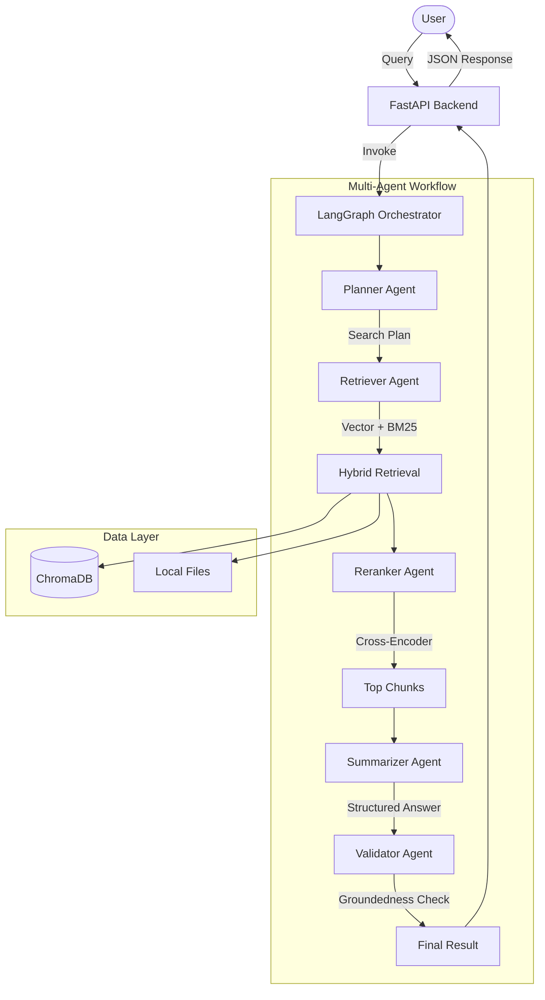

# MEKA: Multi-Agent Expert Knowledge Assistant

MEKA is an industry-grade Multi-Agent RAG (Retrieval-Augmented Generation) system designed to extract insights from heterogeneous knowledge bases.

## System Architecture



## Key Components

1.  **Hybrid Retrieval**: Combines semantic vector search (ChromaDB + HuggingFace) with keyword-based search (BM25) for high recall.
2.  **Cross-Encoder Reranking**: Uses `sentence-transformers` (MS Marco) to refilter retrieved documents based on actual relevance to the query.
3.  **Multi-Agent Workflow**: Powered by **LangGraph**, ensuring stateful coordination between Planner, Retriever, Reranker, Summarizer, and Validator agents.
4.  **Auditability**: Full logging of agent execution and intermediate steps (traceable reasoning).
5.  **Premium UI**: A modern React-based dashboard to visualize the multi-agent reasoning chain.

## Prerequisites

- Python 3.9+
- Node.js & NPM (for frontend)
- Groq API Key (Llama 3.1 8B)
- Tavily API Key (optional for web search)

## Getting Started

### Backend Setup

1.  Create a `.env` file with your keys:
    ```env
    GROQ_API_KEY=your_key
    TAVILY_API_KEY=your_key
    ```
2.  Install dependencies:
    ```bash
    pip install -r requirements.txt
    ```
3.  Run the API:
    ```bash
    uvicorn app.main:app --reload
    ```

### Frontend Setup

1.  Navigate to `frontend/`:
    ```bash
    cd frontend
    npm install
    npm run dev
    ```

## Tool Choices & Rationale

- **Groq (Llama-3.1-8B-Instant)**: Chosen for its extremely low latency and high performance in agentic reasoning tasks.
- **ChromaDB**: Reliable, persistent, and easy-to-use vector store for local knowledge bases.
- **Cross-Encoder (`ms-marco-MiniLM-L-6-v2`)**: Provides state-of-the-art reranking quality with minimal computational overhead.
- **LangGraph**: Used for fine-grained control over the agent loop and state management.

## Example Queries

- "Summarize the transformation of industries by Artificial Intelligence."
- "What are the key benefits of RAG systems according to the documents?"
- "Explain the differences between GPT and Gemini models."

---
*Created as part of an industry-grade assignment for MEKA implementation.*
